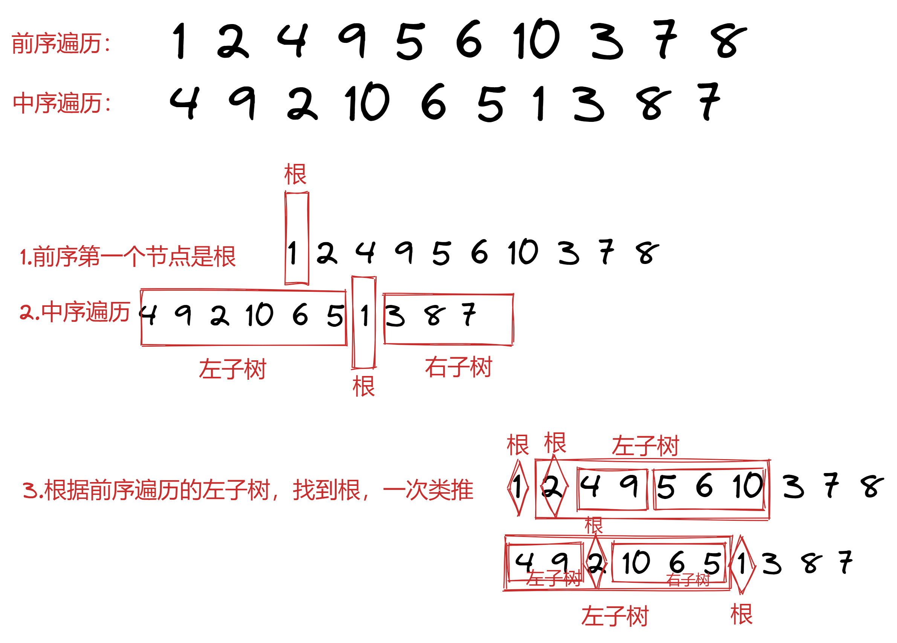
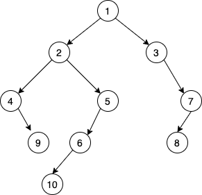

# 什么是树结构

定义

- 一棵树（tree）是由 n（n>0）个元素组成的有限集合，其中：

  - 每个元素称为结点（node）； -有一个特定的结点，称为根结点或根（root）；
  - 除根结点外，其余结点被分成 m（m>=0）个互不相交的有限集合，而每个子集又都是一棵树（称为原树的子树）

概念

- 度

  - 树的度——也即是宽度，简单地说，就是结点的分支数。以组成该树各结点中最大的度作为该树的度，树中度为零的结点称为叶结点或终端结点。树中度不为零的结点称为分枝结点或非终端结点。除根结点外的分枝结点统称为内部结点。

- 深度

  - 树的深度——组成该树各结点的最大层次；

- 层次

  - 根结点的层次为 1，其他结点的层次等于它的父结点的层次数加 1

- 路径

  - 对于一棵子树中的任意两个不同的结点，如果从一个结点出发，按层次自上而下沿着一个个树枝能到达另一结点，称它们之间存在着一条路径。可用路径所经过的结点序列表示路径，路径的长度等于路径上的结点个数减 1

- 森林
  - 指若干棵互不相交的树的集合

## 1. 二叉树

- 二叉树（Binary tree）是树形结构的一个重要类型。许多实际问题抽象出来的数据结构往往是二叉树形式，即使是一般的树也能简单地转换为二叉树，而且二叉树的存储结构及其算法都较为简单，因此二叉树显得特别重要。二叉树特点是每个结点最多只能有两棵子树，且有左右之分 。

- 二叉树是 n 个有限元素的集合，该集合或者为空、或者由一个称为根（root）的元素及两个不相交的、被分别称为左子树和右子树的二叉树组成，是有序树。当集合为空时，称该二叉树为空二叉树。在二叉树中，一个元素也称作一个结点。

- 二叉树（binary tree）是指树中节点的度不大于 2 的有序树，它是一种最简单且最重要的树。二叉树的递归定义为：二叉树是一棵空树，或者是一棵由一个根节点和两棵互不相交的，分别称作根的左子树和右子树组成的非空树；左子树和右子树又同样都是二叉树。

```javascript
// 链表到树的差异
// 1. 链表
class Node {
  constructor(value, next = null) {
    this.val = value;
    this.next = next;
  }
}
// 2. 三叉树
class TreeNode {
  constructor(value, next = null) {
    this.val = value;
    this.next = [TreeNode, TreeNode, TreeNode]; // next指向下一个树的节点
  }
}
```

### 1.1 二叉树的定义

- 非空二叉树只有一个根结点；

- 每一个结点最多有两棵子树，且分别称为该结点的左子树和右子树。即时树中只有一棵子树，也要区分是左子树还是右子树。

### 1.2 二叉树的性质

- 在二叉树的第 n 层上，最多有 2ⁿ﹣¹（n≥1）个结点

  - 2^0 + 2^1 + 2^2 ...

- 深度为 n 的二叉树最多有 2ⁿ-1 个结点

```javascript
2^0 + 2^1 + 2^2 ...
a1( 1 - q^k ) / (1 - q) = 1 * (1 - 2^k) / (1 - 2) = 1 - 2^k / -1 = 2^k - 1
```

- 在任意一棵二叉树中，度为 0 的结点（即叶子结点）总是比度为 2 的结点多一个

  - 总节点数 = 总边数 + 1

```javascript
// 度为0的节点 + 度为2的节点 = 0个节点 + 1个节点 + 2*2个节点 + 1
n0 + n1 + n2 = 0 + n1 + 2n2 + 1
n0 = n2 + 1
```

- 具有 n 个结点的二叉树，其深度至少为［log2n］+1，其中［log2n］表示取 log2n 的整数部分

## 2. 二叉树的遍历

有三种重要的遍历方式

- 前序：根 左 右

- 中序：左 根 右

- 后序：左 右 根

## 3. 操作

根据 中序 + 前/后 遍历结果，还原二叉树。(只需要找出每棵树的根节点即可，前序遍历的第一个肯定是根节点)

练习：

​ 请根据遍历结果，画出二叉树

​ 前： 1 2 4 9 5 6 10 3 7 8​ 中: 4 9 2 10 6 5 1 3 8 7

- 思路

  

- 结果

  

## 4. 二叉树分类

- 完全二叉树 (complete binary tree)

  - 有且只有最后一层不是满的。
  - 最后一层的结点是从左开始排列的，也就是说右子树的右子节点可以少。

- 满二叉树 (full binary tree)

  - 所有结点的度都是 0 或 2 的二叉树。

- 完美二叉树 (perfect binary tree)

  - 二叉树上每一层的结点数都达到了最大。看上去就像上个三角形。

几种二叉树的定义在不同的资料说明中可能存在一定差异，因此在实际场合中提到时请务必进行确认。

## 5. 树结构的理解

- 节点： 代表集合。 边： 代表关系

## 6. 完全二叉树

节省存储边的空间(next)，用数组记录即可，但是会浪费时间。

- 编号为 i 的子节点
  - 左孩子编号为 2 \* i
  - 右孩子编号为 2 \* i + 1

## 7. 二叉树的作用

- AVL 树： 标准语言库中重要的数据检索底层实现

  ​ B+ / B- 树： 文件系统、数据库底层重要数据结构

- 左孩子右兄弟 - 节省空间

  ​ 假设有 n 个节点, 浪费的边数：

  ​ 有效的边数：n - 1 个（根节点不需要边指向）

  ​ 浪费的指针域：

  ​ k 叉树： k \* n - ( n - 1) => (k - 1) \* n + 1

  ​ 2 叉树：2 \* n - (n - 1) => n + 1

  ​ 得出，叉越多，浪费的指针域越多。

- 练习递归的最佳选择

  ​ 递归流程：

## 8. 算法题

- 144.二叉树的前序遍历

给你二叉树的根节点 root ，返回它节点值的 前序 遍历。

```javascript

```

- 105.从前序与中序遍历序列构造⼆叉树

```javascript

```
