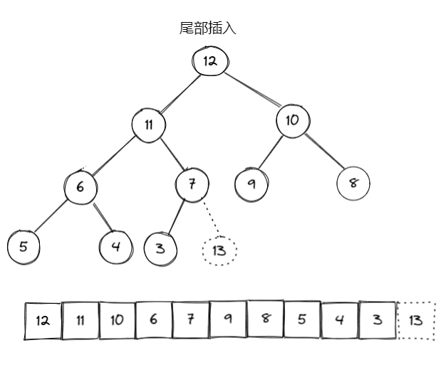
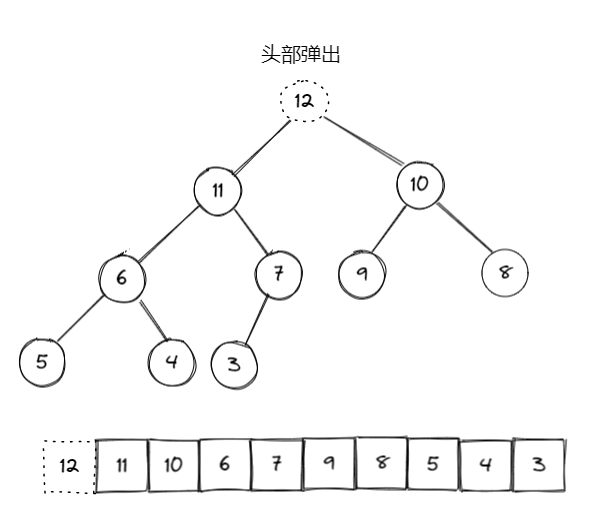
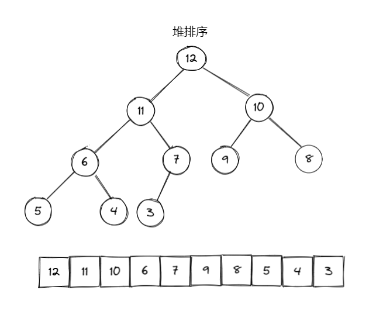

# 什么是堆

堆(Heap)是计算机科学中一类特殊的数据结构的统称。<br/>
堆通常是一个可以被看做一棵完全二叉树的数组对象。

- 大顶(根)堆：任意三元组中(三角形)，父节点大于两个子节点。
- 小顶(根)堆：任意三元组中，父节点小于两个子节点。

## 1. 性质

- 堆中某个节点的值总是不大于（或不小于）其父节点的值
- 堆总是一颗完全二叉树

## 2. 堆的调整

- 尾部插入调整

  1. 尾部插入元素(数组 length-1)
  2. 如果大于父节点，就和父节点交换位置(向上调整)

  ```javascript
  // 数组中，下标从 0 开始，节点位置这样计算

  left(i) = 2i + 1 // i的左子节点位置
  right(i) = 2i + 2 // i的柚子节点位置
  parent(i) = floor((i-1) / 2) // i的父节点位置
  ```



- 头部弹出调整

  1. 头部弹出元素(数组 0)
  2. 用尾元素填充头部位置
  3. 如果此元素小于子元素，就和子元素交换位置(向下调整)



- 堆排序

  1. 将堆顶元素与堆尾元素交换
  2. 将此操作看作是堆顶元素弹出操作
  3. 按照头部弹出以后的策略调整堆



## 3. 堆和优先队列

- 堆是优先队列的一种实现方式

## 4. 应用场景

- 集合最值问题

## 5. 代码实现

```javascript
// 小顶堆
class Heap {
  constructor(data = []) {
    this.data = data;
    this.heapify();
  }
  size() {
    return this.data.length;
  }
  // 堆化
  heapify() {
    if (this.size() < 2) return;
    // 开始只有第一个元素，然后依次插入剩下的。也就是说让数组中每个元素，以二叉树尾部插入调整方式，重新排序
    for (let i = 1; i < this.data.length; i++) {
      this.bubbleUp(i);
    }
  }
  // 尾部插入元素
  offer(val) {
    this.data.push(val);
    this.bubbleUp(this.size() - 1); // 在尾巴放入
  }
  // 头部弹出
  poll() {
    if (!this.size()) return null;
    const res = this.data[0];
    this.data[0] = this.data.pop();
    if (this.size()) {
      this.bubbleDown(0); // 在头部弹出
    }
    return res;
  }
  // 向下调整
  bubbleDown(idx) {
    const lastIdx = this.size() - 1;
    while (idx < lastIdx) {
      let leftIdx = idx * 2 + 1;
      let rightIdx = idx * 2 + 2;
      // 比较当前值是否大于左右子节点
      let findIdx = idx;
      if (this.data[leftIdx] < this.data[findIdx]) {
        findIdx = leftIdx;
      }
      if (this.data[rightIdx] < this.data[findIdx]) {
        findIdx = rightIdx;
      }

      if (findIdx === idx) break;
      this.swap(idx, findIdx);
      idx = findIdx;
    }
  }
  // 向上调整
  bubbleUp(idx) {
    while (idx > 0) {
      // 计算父节点位置
      const parentIdx = Math.floor((idx - 1) / 2);
      // 如果当前节点大于父节点，则跳出
      if (this.data[idx] > this.data[parentIdx]) break;
      // 交换节点
      this.swap(idx, parentIdx);
      idx = parentIdx;
    }
  }
  // 交换
  swap(i, j) {
    if (i === j) return;
    [this.data[i], this.data[j]] = [this.data[j], this.data[i]];
  }
}

const heap = new Heap([12, 11, 10, 6, 7, 9, 8, 5, 4, 3]);
heap.poll();
heap.poll();
heap.offer(1);
console.log(heap);
```

```javascript
//大顶堆
class Heap {
  constructor(data = []) {
    this.data = data;
    this.heapify();
  }
  size() {
    return this.data.length;
  }
  heapify() {
    if (this.size() < 2) return;
    // 开始只有第一个元素，然后依次插入剩下的。也就是说让数组中每个元素，以二叉树尾部插入调整方式，重新排序
    for (let i = 1; i < this.data.length; i++) {
      this.bubbleUp(i);
    }
  }
  offer(val) {
    this.data.push(val);
    this.bubbleUp(this.size() - 1);
  }
  poll() {
    if (!this.size()) return null;
    const res = this.data[0];
    this.data[0] = this.data.pop();
    if (this.size()) {
      this.bubbleDown(0);
    }
    return res;
  }
  bubbleUp(index) {
    while (index > 0) {
      const parentIndex = Math.floor((index - 1) / 2);
      if (this.data[index] < this.data[parentIndex]) break;
      this.swap(index, parentIndex);
      index = parentIndex;
    }
  }

  bubbleDown(index) {
    const lastIndex = this.size() - 1;
    while (index < lastIndex) {
      let leftIndex = index * 2 + 1;
      let rightIndex = index * 2 + 2;
      let findIndex = index;
      if (this.data[leftIndex] > this.data[findIndex]) {
        findIndex = leftIndex;
      }
      if (this.data[rightIndex] > this.data[findIndex]) {
        findIndex = rightIndex;
      }
      if (findIndex === index) break;
      this.swap(index, findIndex);
      index = findIndex;
    }
  }
  swap(i, j) {
    if (i === j) return;
    [this.data[i], this.data[j]] = [this.data[j], this.data[i]];
  }
}

const heap = new Heap([12, 11, 10, 6, 7, 9, 8, 5, 4, 3]);
```
