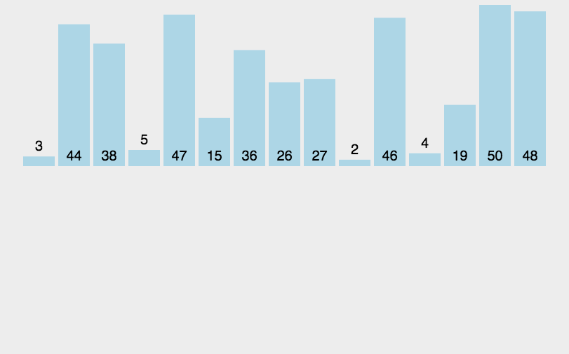

# 什么是排序

将杂乱无章的数据元素，通过一定的方法按关键字顺序排列的过程叫做排序。

- 稳定排序

  - 假设在待排序的文件中，存在两个或两个以上的记录具有相同的关键字，在用某种排序法排序后，若这些相同关键字的元素的相对次序仍然不变（如果a原本在b前面，而a=b，排序之后a仍然在b的前面。），则这种排序方法是稳定的。

- 就地排序
  
  - 若排序算法所需的辅助空间并不依赖于问题的规模n，即辅助空间为O(1)，则称为就地排序

- 内部排序

  - 若整个排序过程不需要访问外存便能完成，则称此类排序问题为内部排序。

- 外部排序

  - 外部排序指的是大文件的排序，即待排序的记录存储在外存储器上，待排序的文件无法一次装入内存，需要在内存和外部存储器之间进行多次数据交换，以达到排序整个文件的目的。 待排序的记录存储在外存上，排序时把数据一部分一部分的调入内存进行排序，在排序中需要多次进行内外存的交互，对外存文件中的记录进行排序后的结果仍然被放到原有文件中。这种排序方法就称外部排序。

## 十大排序

十种常见排序算法可以分为两大类：

- 比较类排序：通过比较来决定元素间的相对次序，由于其时间复杂度不能突破O(nlogn)，因此也称为非线性时间比较类排序。

- 非比较类排序：不通过比较来决定元素间的相对次序，它可以突破基于比较排序的时间下界，以线性时间运行，因此也称为线性时间非比较类排序。

分类：


复杂度：

[参考链接(含动图)](https://www.cnblogs.com/onepixel/p/7674659.html)

### 1. 冒泡排序（Bubble Sort）

冒泡排序是一种简单的排序算法。它重复地走访过要排序的数列，一次比较两个元素，如果它们的顺序错误就把它们交换过来。走访数列的工作是重复地进行直到没有再需要交换，也就是说该数列已经排序完成。这个算法的名字由来是因为越小的元素会经由交换慢慢“浮”到数列的顶端。

- 比较相邻的元素。如果第一个比第二个大，就交换它们两个；

- 对每一对相邻元素作同样的工作，从开始第一对到结尾的最后一对，这样在最后的元素应该会是最大的数；

- 针对所有的元素重复以上的步骤，除了最后一个；

- 重复步骤1~3，直到排序完成。


```javascript
function bubbleSort(arr) {
  let len = arr.length - 1
  for(let i = 0; i < len; i++) {
    for(let j = 0; j < len - i; j++) { // i后面的已经排好了，所以要减去i
      if(arr[j] > arr[j+1]) {
        [arr[j], arr[j+1]] = [arr[j+1], arr[j]]
      }
    }
  }
  return arr
}
```

### 2. 选择排序 (Selection-sort)

选择排序(Selection-sort)是一种简单直观的排序算法。它的工作原理：首先在未排序序列中找到最小（大）元素，存放到排序序列的起始位置，然后，再从剩余未排序元素中继续寻找最小（大）元素，然后放到已排序序列的末尾。以此类推，直到所有元素均排序完毕。

- 初始状态：无序区为R[1..n]，有序区为空；

- 第i趟排序(i=1,2,3…n-1)开始时，当前有序区和无序区分别为R[1..i-1]和R(i..n）。该趟排序从当前无序区中-选出关键字最小的记录 R[k]，将它与无序区的第1个记录R交换，使R[1..i]和R[i+1..n)分别变为记录个数增加1个的新有序区和记录个数减少1个的新无序区；

- n-1趟结束，数组有序化了。


```javascript
function selectionSort(arr) {
  let len = arr.length - 1
  let minIndex
  for(let i = 0; i < len; i++) {
    minIndex = i
    for(let j = i+1; j < len; j++) {
      if(arr[j] < arr[minIndex]) {
        minIndex = j
      }
    }
    [arr[i], arr[minIndex]] = [arr[minIndex], arr[i]]
  }
  return arr
}
```

### 3. 插入排序（Insertion Sort）

插入排序（Insertion-Sort）的算法描述是一种简单直观的排序算法。它的工作原理是通过构建有序序列，对于未排序数据，在已排序序列中从后向前扫描，找到相应位置并插入。

- 从第一个元素开始，该元素可以认为已经被排序；

- 取出下一个元素，在已经排序的元素序列中从后向前扫描；

- 如果该元素（已排序）大于新元素，将该元素移到下一位置；

- 重复步骤3，直到找到已排序的元素小于或者等于新元素的位置；

- 将新元素插入到该位置后；

- 重复步骤2~5。



```javascript
function insertionSort(arr) {
  let len = arr.length - 1
  let preIndex, current
  for(let i = 1; i < len; i++) { // 假设第一个元素已经排序，从第二个元素开始
    preIndex = i - 1
    current = arr[i]
    while(preIndex >= 0 && arr[preIndex] > current) { // 满足条件，一次后移
      arr[preIndex+1] = arr[preIndex]
      preIndex--
    }
    // 后移结束，然后插入
    arr[preIndex + 1] = current
  }
  return arr
}
```

### 4. 希尔排序（Shell Sort）

1959年Shell发明，第一个突破O(n2)的排序算法，是简单插入排序的改进版。它与插入排序的不同之处在于，它会优先比较距离较远的元素。希尔排序又叫缩小增量排序。

- 选择一个增量序列t1，t2，…，tk，其中ti>tj，tk=1；

- 按增量序列个数k，对序列进行k 趟排序；

- 每趟排序，根据对应的增量ti，将待排序列分割成若干长度为m 的子序列，分别对各子表进行直接插入排序。仅增量因子为1 时，整个序列作为一个表来处理，表长度即为整个序列的长度。


```javascript
function shellSort(arr) {
  let len = arr.length
  for(let gap = Math.floor(len / 2); gap > 0; gap = Math.floor(gap / 2)) {
    for(let i = gap; i < len; i++) {
      let j = i
      let current = arr[i]
      while(j - gap >= 0 && current < arr[j - gap]) {
        arr[j] = arr[j - gap]
        j = j - gap
      }
      arr[i] = current
    }
  }
  return arr
}
```

### 5. 归并排序（Merge Sort）

归并排序是建立在归并操作上的一种有效的排序算法。该算法是采用分治法（Divide and Conquer）的一个非常典型的应用。将已有序的子序列合并，得到完全有序的序列；即先使每个子序列有序，再使子序列段间有序。若将两个有序表合并成一个有序表，称为2-路归并。

- 首先将这个数组分成左右两部分，并让左右两部分有序

  - 对这两个子序列分别采用归并排序；

    - 继续把左边部分分成两部分，并使两部分有序

    - 继续把右边部分分成两部分，并使两部分有序

    - 把两部分合并成一个有序数组

- 将两个排序好的子序列合并成一个最终的排序序列。


```javascript
// 二路合并
function mergeSort1(arr) {
  let len = arr.length
  if(len < 2) return arr
  let middle = Math.floor(len / 2)
  let left  =  arr.slice(0,middle)
  let right = arr.slice(middle)
  return merge(mergeSort(left), mergeSort(right))  // 递归
}

function merge(left, right) {
  let result = []
  while(left.length>0 && right.length>0) {
    if (left[0] <= right[0]) {
      result.push(left.shift());
    } else {
       result.push(right.shift());
    }
  }

  while (left.length)
    result.push(left.shift());

  while (right.length)
    result.push(right.shift());

  return result;
}

function mergeSort2(arr, l, r) {

}
console.log(arr, 0, arr.length-1)
```

### 6. 快速排序（Quick Sort）

快速排序的基本思想：通过一趟排序将待排记录分隔成独立的两部分，其中一部分记录的关键字均比另一部分的关键字小，则可分别对这两部分记录继续进行排序，以达到整个序列有序。

- 从数列中挑出一个元素，称为 “基准”（pivot）；

- 重新排序数列，所有元素比基准值小的摆放在基准前面，所有元素比基准值大的摆在基准的后面（相同的数可以到任一边）。在这个分区退出之后，该基准就处于数列的中间位置。这个称为分区（partition）操作；

- 递归地（recursive）把小于基准值元素的子数列和大于基准值元素的子数列排序。

#### 优化

STL： 世界上最快的排序。

STL中的sort并非只是普通的快速排序，除了对普通的快速排序进行优化，它还结合了插入排序和堆排序。 根据不同的数量级别以及不同情况，能自动选用合适的排序方法。

  1. 当数据量较大时采用快速排序，分段递归。

  2. 一旦分段后的数据量小于某个阀值，为避免递归调用带来过大的额外负荷，便会改用插入排序。

  3. 而如果递归层次过深，有出现最坏情况的倾向，还会改用堆排序。

  4. 单边递归法实现

  5. 基准值的选择 针对比较比较有序的序列，容易退化为 n^2 的冒泡排序。 1，2，3，4，5，6，7，2，9 三点取中法

  6. threshold 分段较小时，用插入排序。

  7. 减少特判  将最小值放到左边，避免插入排序时越界。


```javascript
let arr = [5,3,2,4,8,7,9,1,24,14,12]

// left 左边界  right 有边界
function quickSort1(arr, left, right) {
  if(left >= right) return // 指针最终相等，停止递归

  let x = left, y = right // x 左指针  y右指针
  let base = arr[left] // 基准

  
  while(x < y) {
    // 右指针往左走
    while(x < y && arr[y] >=base) y--
    if(x < y) arr[x++] = arr[y]

    // 左指针往右走
    while(x < y && arr[x] <=base) x++
    if(x < y) arr[y--] = arr[x]
  }

  arr[x] = base

  quickSort1(arr, left, x-1)
  quickSort1(arr, x+1, right)
}

// 测试
quickSort(arr, 0, arr.length-1)


function quickSort2(arr, left, right) {
  if(left >= right) return // 指针最终相等，停止递归
  while(left < right) {
    let x = left, y = right, base = arr[x]
    while(x < y) {
      // 右指针往左走
      while(x < y && arr[y] >=base) y--
      if(x < y) arr[x++] = arr[y]

      // 左指针往右走
      while(x < y && arr[x] <=base) x++
      if(x < y) arr[y--] = arr[x]
    }
    arr[x] = base

    quickSort2(arr, x+1, right)
    right = x - 1
  }
}


function median(a, b, c) {
  if(a > b) [a, b] = [b, a];
  if(a > c) [a, c] = [c, a];
  if(b > c) [c, b] = [b, c];
  return b;
}
// 三点取中法 15
const threshold = 3; 
const _quickSort3 = function (arr, l, r){
  while( l - r > threshold) {
    let x = l; y = r; base = median(arr[l], arr[(l + r) >> 1], arr[r]);
    do {
      while(arr[x] < base) x++;
      while(arr[y] > base) y--;
      if(x <= y) {
        [arr[x], arr[y]] = [arr[y], arr[x]];
        x++; y--;
      }

      quickSort3(arr, x , r);
    } while(x <= y)
  }
}

const quickSort3 = function(arr, l, r) {
  _quickSort3(arr, l, r);

  inbsert_sort(arr, l, r);
}

const inbsert_sort = function(arr, l, r) {
  let ind = l; // 最小值

  // 查找最小值， 放到最前面 //// 减少特判
  for(let i = 1; i< r; i++) { // 查找最小值
    if(arr[i] < arr[ind]) ind = i;
  }
  while(ind > l) { // 将最小值移动到最前面
    [arr[ind], arr[ind - 1]] = [arr[ind - 1], arr[ind]]
  }

  for(let i = l + 2; i<=r; i++) {
    let j = i; // i：当前要插入的元素   j: 与当前要插入的元素比较的元素
    while(arr[i] < arr[j - 1]) {
      [arr[i], arr[j - 1]] = [ arr[j-1], arr[i]];
      j--;
    }
  }
}

quickSort3(arr, 0 , arr.length - 1);
console.log(arr);


```

### 7. 堆排序

堆排序（Heapsort）是指利用堆这种数据结构所设计的一种排序算法。堆积是一个近似完全二叉树的结构，并同时满足堆积的性质：即子结点的键值或索引总是小于（或者大于）它的父节点。

- 将初始待排序关键字序列(R1,R2….Rn)构建成大顶堆，此堆为初始的无序区；

- 将堆顶元素R[1]与最后一个元素R[n]交换，此时得到新的无序区(R1,R2,……Rn-1)和新的有序区(Rn),且满足R[1,2…n-1]<=R[n]；

- 由于交换后新的堆顶R[1]可能违反堆的性质，因此需要对当前无序区(R1,R2,……Rn-1)调整为新堆，然后再次将R[1]与无序区最后一个元素交换，得到新的无序区(R1,R2….Rn-2)和新的有序区(Rn-1,Rn)。不断重复此过程直到有序区的元素个数为n-1，则整个排序过程完成。


```javascript
var len
function buildMaxHeap(arr) {
  len = arr.length

  for(let i = Math.floor(len/2); i>=0 i--) {
    heapify(arr,i)
  }
}

function heapify(arr, i) {
  let left = 2 * i + 1
  let right = 2 * i + 2
  largest = i

  if(left < len && arr[left] > arr[largest]) {
    largest = left;
  }

  if (right < len && arr[right] > arr[largest]) {
    largest = right;
  }

  if(largest !=i) {
    swap(arr, i, largest)
    heapify(arr, largest)
  }
}

function swap(arr, i, j) {
  [arr[i], arr[j]] = [arr[j], arr[i]]
}

function heapSort(arr) {
  buildMaxHeap(arr)

  for(let i = arr.length - 1; i > 0; i--) {
    swap(arr, 0, i)
    len--
    heapify(arr, 0)
  }
  return arr
}

```

### 8. 计数排序（Counting Sort）

计数排序不是基于比较的排序算法，其核心在于将输入的数据值转化为键存储在额外开辟的数组空间中。 作为一种线性时间复杂度的排序，计数排序要求输入的数据必须是有确定范围的整数。

- 找出待排序的数组中最大和最小的元素；

- 统计数组中每个值为i的元素出现的次数，存入数组C的第i项；

- 对所有的计数累加（从C中的第一个元素开始，每一项和前一项相加）；

- 反向填充目标数组：将每个元素i放在新数组的第C(i)项，每放一个元素就将C(i)减去1。


```javascript
function countingSort(arr, maxValue) {
  let bucket = new Array(maxValue + 1),
      sortedIndex = 0,
      arrLen = arr.length,
      bucketLen = maxValue + 1
  
  for(let i = 0; i < arrLen; i++) {
    if(!bucket[arr[i]]) bucket[arr[i]] = 0
    bucket[arr[i]]++
  }

  for(let i = 0; i < bucketLen; i++) {
    while(bucket[i] > 0) {
      arr[sortedIndex++] = i
      bucket[arr[i]]--
    }
  }

  return arr
}
```

### 9. 桶排序（Bucket Sort）

桶排序是计数排序的升级版。它利用了函数的映射关系，高效与否的关键就在于这个映射函数的确定。桶排序 (Bucket sort)的工作的原理：假设输入数据服从均匀分布，将数据分到有限数量的桶里，每个桶再分别排序（有可能再使用别的排序算法或是以递归方式继续使用桶排序进行排）。

- 设置一个定量的数组当作空桶；

- 遍历输入数据，并且把数据一个一个放到对应的桶里去；

- 对每个不是空的桶进行排序；

- 从不是空的桶里把排好序的数据拼接起来。


```javascript
function bucketSort(arr, bucketSize) {
  if (arr.length === 0) {
    return arr;
  }

  var i;
  var minValue = arr[0];
  var maxValue = arr[0];
  for (i = 1; i < arr.length; i++) {
    if (arr[i] < minValue) {
      minValue = arr[i];                // 输入数据的最小值
    } else if (arr[i] > maxValue) {
      maxValue = arr[i];                // 输入数据的最大值
    }
  }

  // 桶的初始化
  var DEFAULT_BUCKET_SIZE = 5;            // 设置桶的默认数量为5
  bucketSize = bucketSize || DEFAULT_BUCKET_SIZE;
  var bucketCount = Math.floor((maxValue - minValue) / bucketSize) + 1;  
  var buckets = new Array(bucketCount);
  for (i = 0; i < buckets.length; i++) {
    buckets[i] = [];
  }

  // 利用映射函数将数据分配到各个桶中
  for (i = 0; i < arr.length; i++) {
    buckets[Math.floor((arr[i] - minValue) / bucketSize)].push(arr[i]);
  }

  arr.length = 0;
  for (i = 0; i < buckets.length; i++) {
    insertionSort(buckets[i]);                      // 对每个桶进行排序，这里使用了插入排序
    for (var j = 0; j < buckets[i].length; j++) {
      arr.push(buckets[i][j]);                     
    }
  }

  return arr;
}
```

### 10. 基数排序（Radix Sort）

基数排序是按照低位先排序，然后收集；再按照高位排序，然后再收集；依次类推，直到最高位。有时候有些属性是有优先级顺序的，先按低优先级排序，再按高优先级排序。最后的次序就是高优先级高的在前，高优先级相同的低优先级高的在前。

- 取得数组中的最大数，并取得位数；

- arr为原始数组，从最低位开始取每个位组成radix数组；

- 对radix进行计数排序（利用计数排序适用于小范围数的特点）；


```javascript
var counter = []
function radixSort(arr, maxDigit) {
  let mod = 10
  let dev = 1
  for(let i = 0; i < maxDigit; i++, dev *=10, mode *=10) {
    for(let j = 0; j < arr.length; j++) {
      let bucket = parseInt((arr[j] % mod) / dev);
      if(counter[bucket]==null) {
        counter[bucket] = [];
      }
      counter[bucket].push(arr[j]);
    }

    var pos = 0;
    for(var j = 0; j < counter.length; j++) {
      var value = null;
      if(counter[j]!=null) {
        while ((value = counter[j].shift()) != null) {
          arr[pos++] = value;
        }
      }
    }
  }

  return arr
}
```
