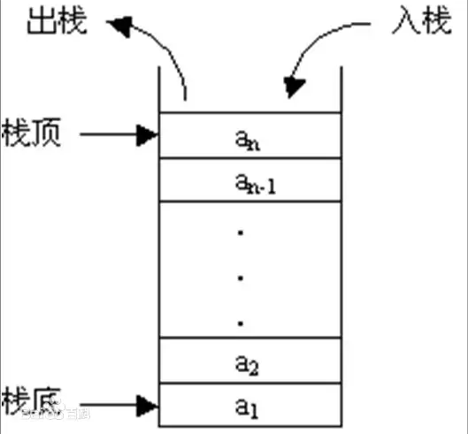

# 什么是栈

- 又名堆栈，它是一种运算受限的线性表。汉字解释： 储存货物或供旅客住宿的房屋 - 货栈、客栈、栈房。可引申为仓库、中转站。

- 引入到计算机领域里，就是指 数据暂时存储的地方 ，所以就有进栈、出栈的说法。

- 只能在表尾进行插入和删除操作，这一端被称为栈顶(另一端称为栈底)，先进入的数据被压入栈底，最后的数据在栈顶。

## 1. 性质

后入先出(LOFI)

## 2. 操作

- 出栈: 头指针向前移动一位

- 入栈：头指针处放入元素，指针向后移动一位



## 3. 括号匹配问题引发的思考

力扣 20. 有效的括号

- 给定一个只包括 '('，')'，'{'，'}'，'['，']'  的字符串 s ，判断字符串是否有效。

- 有效字符串需满足：

  - 左括号必须用相同类型的右括号闭合。
  - 左括号必须以正确的顺序闭合。

```javascript
// 记录左括号和右括号的数量
var isValid = function (s) {
  let lnum = 0,
    rnum = 0;
  for (let i = 0; i < s.length; i++) {
    switch (s[i]) {
      case "(":
        ++lnum;
        break;
      case ")":
        ++rnum;
        break;
    }
    if (rnum > lnum) return false;
  }
  return lnum === rnum;
};

// 优化变量，不需要记录右括号的数量
var isValid = function (s) {
  let lnum = 0;
  for (let i = 0; i < s.length; i++) {
    switch (s[i]) {
      case "(":
        ++lnum;
        break;
      case ")":
        --lnum;
        break;
    }
    if (lnum < 0) return false;
  }
  return lnum === 0;
};
```

由上面代码，可以这样思考，进和出是一个完整的事件
（ --> +1 --> 进

）--> -1 --> 出

左括号： 代表一件事情发生了

右括号：代表一件事情结束了

```javascript
// 1. 代表事件处理
（ （ ）（ ）） ： 表示想要解决一个大问题，先要解决两个小问题。

// 2. 代表函数的执行
// funA想要执行结束，必须funB和funC指向结束
funA {
  funB {}
  funC {}
}
```

题解

```javascript
/**
 * @param {string} s
 * @return {boolean}
 */
var isValid = function (s) {
  let map = {
    "(": ")",
    "[": "]",
    "{": "}",
  };
  let arr = [];
  for (let i = 0; i < s.length; i++) {
    if (map[s[i]]) {
      arr.push(s[i]);
    } else {
      if (map[arr.pop()] !== s[i]) return false;
    }
  }
  return arr.length === 0;
};
```

## 4. 代码实现

```javascript
class Stack() {
  constructor(n) {
    this.arr = new Array(n)
    // 定义栈顶指针，指向栈顶数据(入栈时候要先移动后赋值)
    this.top = -1
    this.n = n
  }
}

// 入栈
Stack.prototype.push = function (val) {
  if(this.isFull()) return false
  this.arr[++this.top] = val
  return true
}

// 出栈
Stack.prototype.pop = function () {
  if(this.isEmpty()) return false
  return this.arr[this.top--] // 返回移出之前的元素
}

// 查看栈顶元素
Stack.prototype.peek = function () {
  if(this.isEmpty()) return -1
  return this.arr[this.top]
}

// 判空
Stack.prototype.isEmpty = function () {
  return this.top === -1
}

// 判满
Stack.prototype.isFull = function () {
  return this.top+1 === this.n
}

// 大小
Stack.prototype.size = function () {
  return this.top++
}
```

## 5. 应用场景

- 数制转换 - 求余法

  - 比如 100 的八进制，100 首先 除以 8 商 12 余 4, 4 首先进栈，然后 12 除以 8 商 1 余 4，第二个余数 4 进栈，接着 1 除以 8，商 0 余 1，第三个余数 1 进栈，最后将三个余数出栈，就得到了 100 的八进制数 144。

- 浏览器的前进和后退功能

  - 我们使用两个栈，比如 A 和 B：

  - 当你依次访问三个页面 1、2、3 的时候，将页面分别入栈，保存为 3、2、1；
  - 当你后退的时候，A 栈顶元素 3 出栈，保存到 B 中。
  - 如果此时你前进，那么 3 会从 B 栈中出来，再次进入 A 栈；
  - 如果此时你访问页面 4，那么 4 会保存到 A 栈中，此时页面 3 就无法再通过前进或者后退访问到，我们需要清空 B 栈；
  - 如此反复循环；

- 处理递归调用

- 二叉树的遍历

- 表达式的转换与求值 leetcode-227.基本计算器

- 子程序的调用

- 图形的深度优先（depth-first）搜索法
