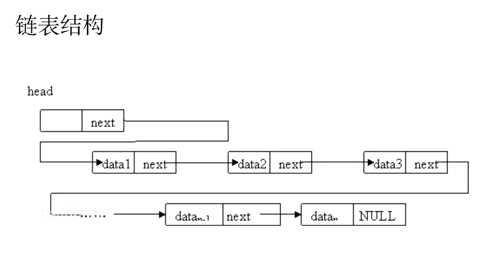
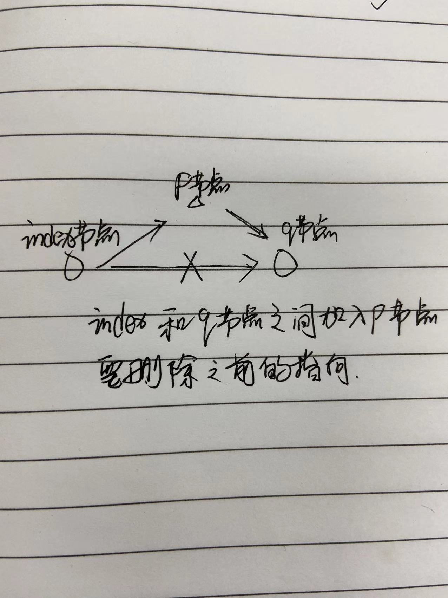
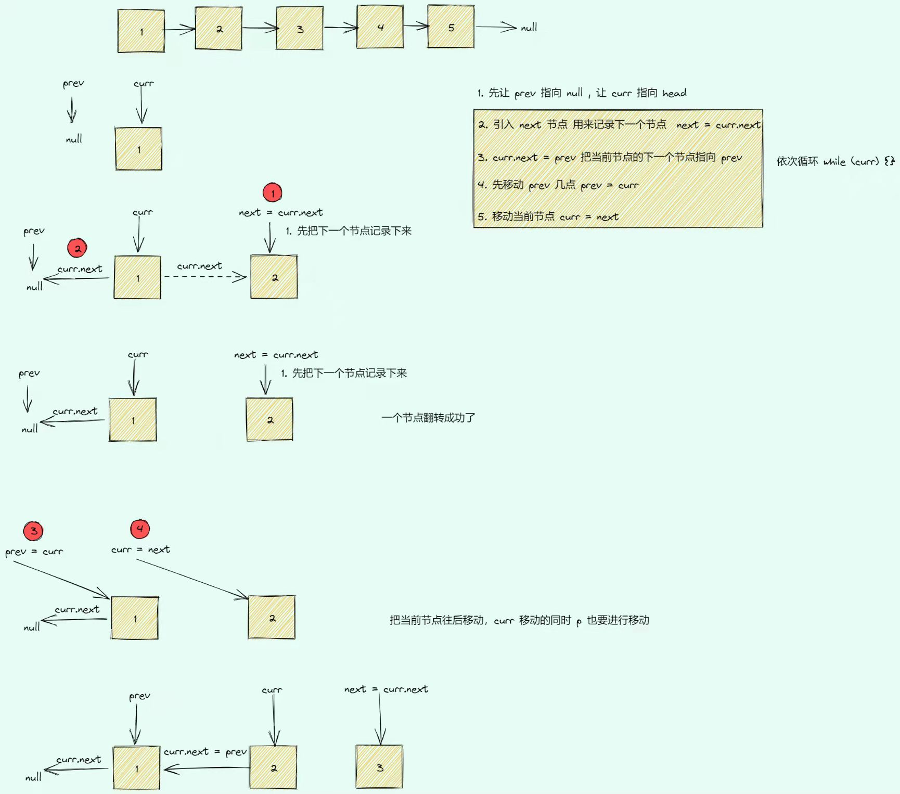
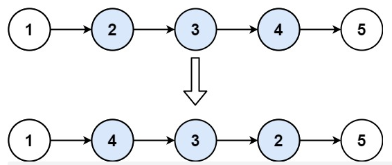

# 什么是链表

- 若干个节点串成一串，这样的一个数据结构
- 链表中每个节点至少包含两个部分，数据域 和 指针域
- 链表的节点，通过指针域的值，形成一个线性结构
- 查找 O(n)，插入和删除 O(1)
- 不是和快速的定位数据，适合动态的插入和删除



## 1. 如何成为链状结构

- 每个阶段都包含两个部分

  - 数据域：用于存储元素本身的数据信息，他不局限于一个成员数据，也可能是多个成员数据
  - 指针域：用于存储直接后继的节点信息

- 通过指针域的值形成了一个线性结构

  - 实现方式：地址、下标、引用

- 不适合快速的定位数据，适合动态的插入和删除

## 2. 双链表

- 有两个指针域，不仅可以向前还可以向后查找

## 3. 链表的实现方式

- 节点+指针

```javascript
class Node {
  constructor(val, next = null) {
    this.val = val;
    this.next = next;
  }
}

function ListNode() {
  let head = new Node(1); // 第一个节点
  head.next = new Node(2); // 第二个节点
  head.next.next = new Node(3); // 第三个节点
  head.next.next.next = new Node(4); // ...

  let p = head,
    ret = "";
  while (p) {
    ret += `${p.val} => `;
    p = p.next;
  }

  ret += "null";
  console.log(ret);
  return ret;
}

ListNode();
```

- 双数组

```javascript
// data 数组存储数据
// next 数组存储指针，存储下一个数据的数组下标
function ListNode() {
  const data = [];
  const next = [];

  // 这里用index作为连接，index后，就相当于当前的next
  // 在index下标后添加一个p节点，节点的值是val
  function addNode(index, p, val) {
    // index节点指针指向p，p指向之前index的下一个节点
    next[p] = next[index]; // 这里p指向index的下一个节点，也就是q（可以理解为存放index的下一个节点）
    next[index] = p; // 这里把index指向新的p节点
    data[p] = val;
  }

  // 假设节点从3开始，值为a
  let head = 3;
  data[3] = "a";

  addNode(3, 5, "b"); // 3后面添加5节点，值是b
  addNode(5, 7, "c"); // 5后面添加7节点，值是c
  addNode(7, 2, "d"); // 7后面添加2节点，值是d
  addNode(2, 1, "e"); // ...
  addNode(7, 4, "f"); // ...
  addNode(2, 6, "g"); // ...

  console.log();

  let p = head,
    ret = "";
  while (p) {
    ret += `${data[p]} => `;
    p = next[p];
  }

  ret += "null";
  console.log(ret);
  console.log(data, next);
  return ret;
}
// '3 => 5 => 7 => 4 => 2 => 6 => 1 => null'
// 'a => b => c => f => d => g => e => null'
```

手动画图


## 4. 应用场景

- 操作系统内的动态内存分配
- LRU 缓存淘汰算法
  - 缓存：高速设备之于低速设备的一种称呼
  - 缓存维护
    - 链表结构：链表 + hash
    - 放入新数据时，淘汰旧数据
- JS Map 底层

## 5. 力扣

### 1)环状链表

#### 141.环形链表

给定一个链表，判断链表中是否有环。

如果链表中有某个节点，可以通过连续跟踪 next 指针再次到达，则链表中存在环。 为了表示给定链表中的环，我们使用整数 pos 来表示链表尾连接到链表中的位置（索引从 0 开始）。 如果 pos 是 -1，则在该链表中没有环。注意：pos 不作为参数进行传递，仅仅是为了标识链表的实际情况。

如果链表中存在环，则返回 true 。 否则，返回 false 。

---

**解题思路：快慢指针, 直接比较的节点，就是比较引用地址**

```javascript
/**
 * Definition for singly-linked list.
 * function ListNode(val) {
 *     this.val = val;
 *     this.next = null;
 * }
 */

// 设置一快一慢两个指针
/**
 * @param {ListNode} head
 * @return {boolean}
 */
var hasCycle = function (head) {
  if (!head) return false;
  let slow = head;
  let fast = head.next;
  while (fast && fast.next && slow) {
    slow = slow.next;
    fast = fast.next.next;
    if (slow === fast) {
      return true;
    }
  }
  return false;
};
```

#### 142.环形链表 II

给定一个链表，返回链表开始入环的第一个节点。  如果链表无环，则返回  null。

为了表示给定链表中的环，我们使用整数 pos 来表示链表尾连接到链表中的位置（索引从 0 开始）。 如果 pos 是 -1，则在该链表中没有环。注意，pos 仅仅是用于标识环的情况，并不会作为参数传递到函数中。

说明：不允许修改给定的链表。

**解题思路：快慢指针**

```javascript
/**
 * Definition for singly-linked list.
 * function ListNode(val) {
 *     this.val = val;
 *     this.next = null;
 * }
 */

/**
 * @param {ListNode} head
 * @return {ListNode}
 */
var detectCycle = function (head) {
  if (!head || !head.next) return null;

  // 刚开始先走一步
  let slow = head.next;
  let fast = head.next.next;

  // 判断是否有环
  while (slow !== fast && fast && fast.next) {
    slow = slow.next;
    fast = fast.next.next;
  }
  if (slow !== fast) return null;

  // 走到这里说明肯定有环,slow和fast相遇的距离=环的长度-相遇点离入口的距离，也就是head离入口的距离
  fast = head; // 让fast从头走，两个相遇就是入口点
  while (slow !== fast) {
    slow = slow.next;
    fast = fast.next;
  }

  return slow;
};
```


### 2)反转链表

#### 206.反转链表

给你单链表的头节点 head ，请你反转链表，并返回反转后的链表。

**解题思路：定义三个指针，next 存储当前的 next 指针**

```javascript
/**
 * Definition for singly-linked list.
 * function ListNode(val, next) {
 *     this.val = (val===undefined ? 0 : val)
 *     this.next = (next===undefined ? null : next)
 * }
 */
// 指针方式
/**
 * @param {ListNode} head
 * @return {ListNode}
 */
var reverseList = function (head) {
  if (!head || !head.next) return head;

  // 给1元素前定义一个null，cur节点指向1，next指向2
  let pre = null;
  let cur = head;

  while (cur) {
    // 存储当前元素的下一个指向
    let next = cur.next;
    // 使当前节点指向上一个，也就是我们定义的null
    cur.next = pre;

    pre = cur;
    cur = next;
  }
  return pre;
};

// 递归方式
var reverseList = function (head) {
  if (!head || !head.next) return head;

  let pre = head;
  let cur = head.next;

  // 返回反转后的链表
  let p = reverseList(head.next);

  // 最里层的递归先执行，pre=4 next=5, 4指向null 5指向4。递归依次执行，层层指向
  pre.next = null;
  cur.next = pre;

  return p;
};
```



#### 92.反转链表 II

给你单链表的头指针 head 和两个整数  left 和 right ，其中  left <= right 。请你反转从位置 left 到位置 right 的链表节点，返回 反转后的链表 。

**解题思路：使用「206. 反转链表」的解法，反转 left 到 right 部分以后，再拼接起来。我们还需要记录 left 的前一个节点，和 right 的后一个节点.**

第 1 步：先将待反转的区域反转；

第 2 步：把 pre 的 next 指针指向反转以后的链表头节点，把反转以后的链表的尾节点的 next 指针指向 succ。

```javascript
var reverseBetween = function (head, left, right) {
  // 因为头节点有可能发生变化，使用虚拟头节点可以避免复杂的分类讨论 按我的理解应该是方便用index模拟指针
  const dummyNode = new ListNode(-1);
  dummyNode.next = head;

  let pre = dummyNode;
  // 第 1 步：从虚拟头节点走 left - 1 步，来到 left 节点的前一个节点
  // 建议写在 for 循环里，语义清晰
  for (let i = 0; i < left - 1; i++) {
    pre = pre.next;
  }

  // 第 2 步：从 pre 再走 right - left + 1 步，来到 right 节点
  let rightNode = pre;
  for (let i = 0; i < right - left + 1; i++) {
    rightNode = rightNode.next;
  }

  // 第 3 步：切断出一个子链表（截取链表）
  let leftNode = pre.next;
  let curr = rightNode.next;

  // 注意：切断链接
  pre.next = null;
  rightNode.next = null;

  // 第 4 步：同第 206 题，反转链表的子区间
  reverseList(leftNode);

  // 第 5 步：接回到原来的链表中 1->4  2->5
  pre.next = rightNode; //
  leftNode.next = curr;
  return dummyNode.next;
};

const reverseList = (head) => {
  if (!head || !head.next) return head;
  let pre = null;
  let cur = head;

  while (cur) {
    const next = cur.next;
    cur.next = pre;
    pre = cur;
    cur = next;
  }
};
```



### 3)删除元素

#### 83.删除排序链表中的重复元素

- 存在一个按升序排列的链表，给你这个链表的头节点 head ，请你删除所有重复的元素，使每个元素 只出现一次 。

- 返回同样按升序排列的结果链表。

**解题思路：一直循环，如果当前的值和下一个值相同，那么就指向下下个值，一直找到不一样的为止。地址相同，但是节点的 val 可能相同，比较 val。**

```javascript
/**
 * Definition for singly-linked list.
 * function ListNode(val, next) {
 *     this.val = (val===undefined ? 0 : val)
 *     this.next = (next===undefined ? null : next)
 * }
 */
/**
 * @param {ListNode} head
 * @return {ListNode}
 */
var deleteDuplicates = function (head) {
  let current = head;
  while (current && current.next) {
    if (current.val === current.next.val) {
      current.next = current.next.next;
    } else {
      current = current.next;
    }
  }
  return head;
};
```

#### 19. 删除链表的倒数第 N 个结点

给你一个链表，删除链表的倒数第 n 个结点，并且返回链表的头结点。

在对链表进行操作时，一种常用的技巧是添加一个哑节点（dummy node），它的 next 指针指向链表的头节点。这样一来，我们就不需要对头节点进行特殊的判断了。

例如，在本题中，如果我们要删除节点 y，我们需要知道节点 y 的前驱节点 x，并将 x 的指针指向 y 的后继节点。但由于头节点不存在前驱节点，因此我们需要在删除头节点时进行特殊判断。但如果我们添加了哑节点，那么头节点的前驱节点就是哑节点本身，此时我们就只需要考虑通用的情况即可。

特别地，在某些语言中，由于需要自行对内存进行管理。因此在实际的面试中，对于「是否需要释放被删除节点对应的空间」这一问题，我们需要和面试官进行积极的沟通以达成一致。下面的代码中默认不释放空间。这里 js 在没有指针的情况下，会自动释放空间。

**解题思路：一种容易想到的方法是，我们首先从头节点开始对链表进行一次遍历，得到链表的长度 L。随后我们再从头节点开始对链表进行一次遍历，当遍历到第 L-n+1 个节点时，它就是我们需要删除的节点。**

```javascript
/**
 * Definition for singly-linked list.
 * function ListNode(val, next) {
 *     this.val = (val===undefined ? 0 : val)
 *     this.next = (next===undefined ? null : next)
 * }
 */
/**
 * @param {ListNode} head
 * @param {number} n
 * @return {ListNode}
 */
var removeNthFromEnd = function (head, n) {
  if (!head || !n) return head;

  const dummyNode = new ListNode(0);
  dummyNode.next = head;

  let len = 0;
  let cur = head;
  while (cur) {
    cur = cur.next;
    len++;
  }

  console.log(len);

  // len-n+1是要删除的元素
  cur = dummyNode;
  for (let i = 0; i < len - n; i++) {
    cur = cur.next;
  }
  cur.next = cur.next.next;
  return dummyNode.next;
};

/**
 * 解法2：快慢指针
 * 思路： 此题关键是如何查找倒数第 n 个节点
 * 1. 定义第一个指针 front，先向后走 n  步；
 * 2. 定义第二个指针 after。 fornt 和 after 一同向后走。
 * 3. 当front走到链表尾节点时，after指向的就是倒数第 n 个节点的前一个节点。
 *
 * 技巧： 当头节点有很大概率会改变时，需要用到虚拟头节点的技巧；
 *       就是在头部定义一个虚拟的聊表节点，next指针执行head。
 */
var removeNthFromEnd = function (head, n) {
  if (!head) return null;
  // 定义虚拟头节点
  let ret = new ListNode(-1, head);

  let front = ret;
  while (n--) {
    front = front.next;
  }

  // 定义after指针，然后两个指针一起向后走
  let after = ret;
  while (front.next) {
    after = after.next;
    front = front.next;
  }

  // 此时after，指向倒数第n个节点的前一个节点
  after.next = after.next.next;

  return ret.next;
};
```

### 4) 旋转链表

#### 61. 旋转链表

给你一个链表的头节点 head ，旋转链表，将链表每个节点向右移动 k 个位置。

**解题思路：记给定链表的长度为 n，注意到当向右移动的次数 k≥n 时，我们仅需要向右移动 k mod n 次即可。因为每 n 次移动都会让链表变为原状。这样我们可以知道，新链表的最后一个节点为原链表的第 `n - (k mod n)` 个节点。**

**这样，我们可以先将给定的链表连接成环，然后将指定位置断开。**

**具体代码中，我们首先计算出链表的长度 n，并找到该链表的末尾节点，将其与头节点相连。这样就得到了闭合为环的链表。然后我们找到新链表的最后一个节点（即原链表的第 `n - (k mod n)` 个节点），将当前闭合为环的链表断开，即可得到我们所需要的结果。**

**特别地，当链表长度不大于 1，或者 k 为 n 的倍数时，新链表将与原链表相同，我们无需进行任何处理。**

```javascript
var rotateRight = function (head, k) {
  if (!head || !head.next || k === 0) return head;

  // 记链的长度
  let n = 1;
  let cur = head;
  while (cur.next) {
    cur = cur.next;
    n++;
  }

  // 如果k是链长的倍数，如果k取模为0，也就是刚好k是链长度的倍数，那么直接反回head
  // add的意义：链表只能从左往右走，不能从右往左走，而假如从右往左走k，当前的元素就正好是新链表的head，所以只能转一圈走到新head位置，也就是链表长度-实际k的长度，就是要走几步，就可以找到head
  let add = n - (k % n);
  if (add === n) {
    return head;
  }

  // 形成环，依次改变指针
  cur.next = head;
  while (add) {
    cur = cur.next;
    add--;
  }

  // 截断末尾
  const ret = cur.next;
  cur.next = null;
  return ret;
};
```

### 5)两两交换链表中的节点

#### 24. 两两交换链表中的节点

给定一个链表，两两交换其中相邻的节点，并返回交换后的链表。

你不能只是单纯的改变节点内部的值，而是需要实际的进行节点交换。

**解题思路：1. 创建哑结点 `dummyHead`，令 `dummyHead.next = head`。令 `temp` 表示当前到达的节点，初始时 `temp = dummyHead`。每次需要交换 `temp` 后面的两个节点。如果 `temp` 的后面没有节点或者只有一个节点，则没有更多的节点需要交换，因此结束交换。否则，获得 `temp` 后面的两个节点 `node1` 和 `node2`，通过更新节点的指针关系实现两两交换节点。具体而言，交换之前的节点关系是 `temp -> node1 -> node2`，交换之后的节点关系要变成 `temp -> node2 -> node1`，因此需要进行如下操作。**

**2.可以通过递归的方式实现两两交换链表中的节点。递归的终止条件是链表中没有节点，或者链表中只有一个节点，此时无法进行交换。如果链表中至少有两个节点，则在两两交换链表中的节点之后，原始链表的头节点变成新的链表的第二个节点，原始链表的第二个节点变成新的链表的头节点。链表中的其余节点的两两交换可以递归地实现。在对链表中的其余节点递归地两两交换之后，更新节点之间的指针关系，即可完成整个链表的两两交换。用 `head` 表示原始链表的头节点，新的链表的第二个节点，用 `newHead` 表示新的链表的头节点，原始链表的第二个节点，则原始链表中的其余节点的头节点是 `newHead.next`。令 `head.next = swapPairs(newHead.next)`，表示将其余节点进行两两交换，交换后的新的头节点为 `head` 的下一个节点。然后令 `newHead.next = head`，即完成了所有节点的交换。最后返回新的链表的头节点 newHead。**

```javascript
// 哑节点方式
var swapPairs = function (head) {
  if (!head || !head.next) return head;

  const dH = new ListNode(0);
  dH.next = head;
  let temp = dH;
  while (temp.next && temp.next.next) {
    const node1 = temp.next;
    const node2 = temp.next.next;
    temp.next = node2;
    node1.next = node2.next;
    node2.next = node1;
    temp = node1;
  }

  return dH.next;
};

// 递归方式暂没理解
```

### 6)快乐数

- 编写一个算法来判断一个数 n 是不是快乐数。

- 「快乐数」定义为：

  - 对于一个正整数，每一次将该数替换为它每个位置上的数字的平方和。
  - 然后重复这个过程直到这个数变为 1，也可能是 无限循环 但始终变不到 1。
  - 如果 可以变为 1，那么这个数就是快乐数。

- 如果 n 是快乐数就返回 true ；不是，则返回 false 。

**解题思路：如果不是快乐数，超过最大数字会一直循环出现之前出现过的数字，所以判断是否有环即可**

```javascript
/*
 * @lc app=leetcode.cn id=202 lang=javascript
 *
 * [202] 快乐数
 */

// @lc code=start
/**
 * @param {number} n
 * @return {boolean}
 */
// 如果不是快乐数，超过最大值会一直循环出现之前出现过的数字，所以判断是否有环即可
var isHappy = function (n) {
  let pre = n,
    curr = getNext(n);
  while (curr !== 1) {
    pre = getNext(pre);
    curr = getNext(getNext(curr));
    if (curr === pre) {
      return false;
    }
  }
  return true;
};

// 获取n的下一个数字
function getNext(num) {
  let result = 0;
  while (num) {
    result += (num % 10) * (num % 10); // num%10=num的个位数字 33%10=3
    num = Math.floor(num / 10); // 获取num个位前面的数字
  }
  return result;
}
```
