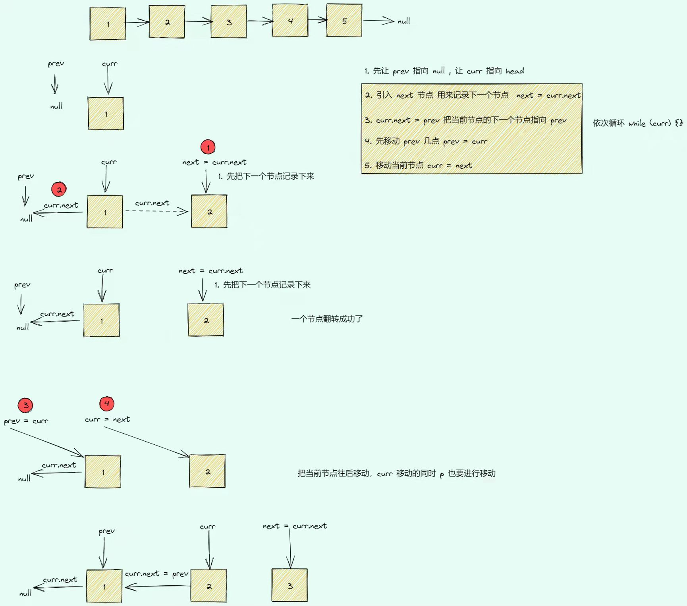

# 什么是链表

- 若干个节点串成一串，这样的一个数据结构
- 链表中每个节点至少包含两个部分，数据域 和 指针域
- 链表的节点，通过指针域的值，形成一个线性结构
- 查找 O(n)，插入和删除 O(1)
- 不是和快速的定位数据，适合动态的插入和删除


## 1. 如何成为链状结构

- 每个阶段都包含两个部分

  - 数据域：用于存储元素本身的数据信息，他不局限于一个成员数据，也可能是多个成员数据
  - 指针域：用于存储直接后继的节点信息

- 通过指针域的值形成了一个线性结构

  - 实现方式：地址、下标、引用

- 不适合快速的定位数据，适合动态的插入和删除

## 2. 双链表

- 有两个指针域，不仅可以向前还可以向后查找

## 3. 链表的实现方式

- 节点+指针

```javascript
class Node {
  constructor(val, next = null) {
    this.val = val;
    this.next = next;
  }
}

function ListNode() {
  let head = new Node(1); // 第一个节点
  head.next = new Node(2); // 第二个节点
  head.next.next = new Node(3); // 第三个节点
  head.next.next.next = new Node(4); // ...

  let p = head,
    ret = "";
  while (p) {
    ret += `${p.val} => `;
    p = p.next;
  }

  ret += "null";
  console.log(ret);
  return ret;
}

ListNode();
```

- 双数组

```javascript
// data 数组存储数据
// next 数组存储指针，存储下一个数据的数组下标
function ListNode() {
  const data = [];
  const next = [];

  // 这里用index作为连接，index后，就相当于当前的next
  // 在index下标后添加一个p节点，节点的值是val
  function addNode(index, p, val) {
    // index节点指针指向p，p指向之前index的下一个节点
    next[p] = next[index]; // 这里p指向index的下一个节点，也就是q（可以理解为存放index的下一个节点）
    next[index] = p; // 这里把index指向新的p节点
    data[p] = val;
  }

  // 假设节点从3开始，值为a
  let head = 3;
  data[3] = "a";

  addNode(3, 5, "b"); // 3后面添加5节点，值是b
  addNode(5, 7, "c"); // 5后面添加7节点，值是c
  addNode(7, 2, "d"); // 7后面添加2节点，值是d
  addNode(2, 1, "e"); // ...
  addNode(7, 4, "f"); // ...
  addNode(2, 6, "g"); // ...

  console.log();

  let p = head,
    ret = "";
  while (p) {
    ret += `${data[p]} => `;
    p = next[p];
  }

  ret += "null";
  console.log(ret);
  console.log(data, next);
  return ret;
}
// '3 => 5 => 7 => 4 => 2 => 6 => 1 => null'
// 'a => b => c => f => d => g => e => null'
```

手动画图


## 4. 应用场景

- 操作系统内的动态内存分配
- LRU 缓存淘汰算法
  - 缓存：高速设备之于低速设备的一种称呼
  - 缓存维护
    - 链表结构：链表 + hash
    - 放入新数据时，淘汰旧数据
- JS Map 底层

## 5. 力扣

### 1)环状链表

- 141.环形链表

给定一个链表，判断链表中是否有环。

如果链表中有某个节点，可以通过连续跟踪 next 指针再次到达，则链表中存在环。 为了表示给定链表中的环，我们使用整数 pos 来表示链表尾连接到链表中的位置（索引从 0 开始）。 如果 pos 是 -1，则在该链表中没有环。注意：pos 不作为参数进行传递，仅仅是为了标识链表的实际情况。

如果链表中存在环，则返回 true 。 否则，返回 false 。

> 解题思路：快慢指针,萌宝啊: 直接比较的节点，就是比较引用地址

```javascript
/**
 * Definition for singly-linked list.
 * function ListNode(val) {
 *     this.val = val;
 *     this.next = null;
 * }
 */

// 设置一快一慢两个指针
/**
 * @param {ListNode} head
 * @return {boolean}
 */
var hasCycle = function (head) {
  if (!head) return false;
  let slow = head;
  let fast = head.next;
  while (fast && fast.next && slow) {
    slow = slow.next;
    fast = fast.next.next;
    if (slow === fast) {
      return true;
    }
  }
  return false;
};
```

- 142.环形链表 II

给定一个链表，返回链表开始入环的第一个节点。  如果链表无环，则返回  null。

为了表示给定链表中的环，我们使用整数 pos 来表示链表尾连接到链表中的位置（索引从 0 开始）。 如果 pos 是 -1，则在该链表中没有环。注意，pos 仅仅是用于标识环的情况，并不会作为参数传递到函数中。

说明：不允许修改给定的链表。

> 解题思路：快慢指针

```javascript
/**
 * Definition for singly-linked list.
 * function ListNode(val) {
 *     this.val = val;
 *     this.next = null;
 * }
 */

/**
 * @param {ListNode} head
 * @return {ListNode}
 */
var detectCycle = function (head) {
  if (!head || !head.next) return null;

  // 刚开始先走一步
  let slow = head.next;
  let fast = head.next.next;

  // 判断是否有环
  while (slow !== fast && fast && fast.next) {
    slow = slow.next;
    fast = fast.next.next;
  }
  if (slow !== fast) return null;

  // 走到这里说明肯定有环
  while (slow !== fast) {
    slow = slow.next;
    fast = fast.next;
  }

  return slow;
};
```


### 2)反转链表

- 206.反转链表

给你单链表的头节点 head ，请你反转链表，并返回反转后的链表。

> 解题思路：定义三个指针，next 存储当前的 next 指针

```javascript
/**
 * Definition for singly-linked list.
 * function ListNode(val, next) {
 *     this.val = (val===undefined ? 0 : val)
 *     this.next = (next===undefined ? null : next)
 * }
 */
/**
 * @param {ListNode} head
 * @return {ListNode}
 */
var reverseList = function (head) {
  if (!head || !head.next) return head;

  // 给1元素前定义一个null，cur节点指向1，next指向2
  let pre = null;
  let cur = head;

  while (cur) {
    // 存储当前元素的下一个指向
    let next = cur.next;
    // 使当前节点指向上一个，也就是我们定义的null
    cur.next = pre;

    pre = cur;
    cur = next;
  }
  return pre;
};
```



- 92.反转链表 II

给你单链表的头指针 head 和两个整数  left 和 right ，其中  left <= right 。请你反转从位置 left 到位置 right 的链表节点，返回 反转后的链表 。

> 解题思路：使用「206. 反转链表」的解法，反转 left 到 right 部分以后，再拼接起来。我们还需要记录 left 的前一个节点，和 right 的后一个节点

### 3)删除排序链表中的重复元素

- 83.删除排序链表中的重复元素

  - 存在一个按升序排列的链表，给你这个链表的头节点 head ，请你删除所有重复的元素，使每个元素 只出现一次 。

  - 返回同样按升序排列的结果链表。

> 解题思路：一直循环，如果当前的值和下一个值相同，那么就指向下下个值，一直找到不一样的为止。地址相同，但是节点的 val 可能相同，比较 val。

```javascript
/**
 * Definition for singly-linked list.
 * function ListNode(val, next) {
 *     this.val = (val===undefined ? 0 : val)
 *     this.next = (next===undefined ? null : next)
 * }
 */
/**
 * @param {ListNode} head
 * @return {ListNode}
 */
var deleteDuplicates = function (head) {
  let current = head;
  while (current && current.next) {
    if (current.val === current.next.val) {
      current.next = current.next.next;
    } else {
      current = current.next;
    }
  }
  return head;
};
```
